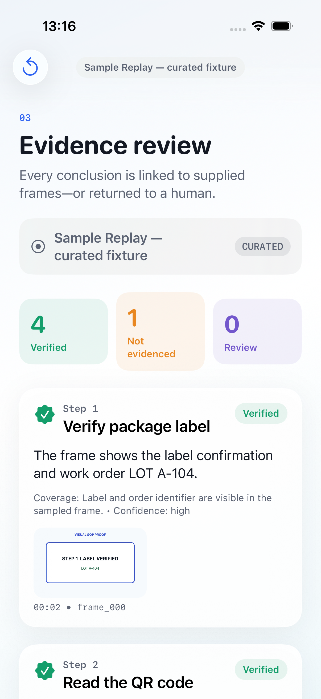

# Visual SOP Proof

Visual SOP Proof is an iOS evidence-review app for logistics inspections. It converts a PDF standard operating procedure (SOP) into observable checks, evaluates timestamped frames from a 30–60 second work video with GPT-5.6, and produces a Markdown and PDF audit-assistance report.

The core product claim is deliberately narrow: the app reports what the supplied frames do and do not evidence. It never converts missing visual evidence into a claim that an action did not happen.



The differentiating evidence boundary and report controls are shown in
[the Step 3 screenshot](artifacts/screenshots/step-3-evidence-boundary.png) and
[the report-export screenshot](artifacts/screenshots/report-export.png).

## Competition category

OpenAI Build Week — Work & Productivity.

Devpost project: https://devpost.com/software/visual-sop-proof

Local submission video: [artifacts/demo/visual-sop-proof-demo.mp4](artifacts/demo/visual-sop-proof-demo.mp4) — 2 minutes 22.20 seconds with English narration.

## Demo in one minute

1. Open the app in an iPhone Simulator.
2. Tap **Explore Sample Replay**.
3. Review the five SOP checks and their supporting timestamps.
4. Open Step 3 to see why side-damage inspection is **Not evidenced**.
5. Export the evidence report.

Sample Replay is an immutable, clearly labeled curated fixture—not a live or recorded OpenAI response. It works offline and travels through the same validation, timeline, and report pipeline as Live GPT mode. Live mode is the path that calls GPT-5.6.

## What GPT-5.6 does

- Converts extracted SOP text into four to six video-observable checks.
- Reviews bounded, timestamped video frames.
- Returns strict JSON with one of four evidence states: `verified`, `not_evidenced`, `contradicted`, or `needs_review`.
- Names only supplied frame IDs; the iOS app owns the timestamp mapping and rejects unknown IDs.
- Explains observed facts, missing views, confidence, and the reason for human review.

## What Codex did

Codex was used throughout product scoping, official-documentation verification, architecture, implementation, test generation, sample-fixture creation, security review, and submission preparation. Five independent pre-implementation reviews challenged product fit, iOS architecture, AI evaluation semantics, security, and reproducibility. Their accepted findings are recorded in [docs/DESIGN.md](docs/DESIGN.md).

## Architecture

- SwiftUI iOS app targeting iOS 17 or newer.
- PDFKit for local PDF text extraction.
- AVFoundation for deterministic, bounded frame sampling.
- Deterministic frame reduction to at most 280 KiB per JPEG, plus a 24 MiB request preflight.
- A Python standard-library loopback proxy for OpenAI API calls.
- GPT-5.6 through the Responses API with strict JSON schemas.
- SHA-256 provenance for the source SOP, video, compiled SOP, and sampled frames.
- Deterministic Markdown and PDF report generation on device.

The OpenAI API key never enters the app bundle, source tree, plist, logs, or sample fixture. The proxy binds only to `127.0.0.1`, requires a per-launch bearer token, and enforces request, image-count, MIME-type, and schema limits.

## Verified toolchain

- macOS with Xcode 26.6 (17F113)
- iOS 26.5 Simulator runtime and Apple Swift 6.3.3
- Python 3.11 or newer for Live GPT mode
- XcodeGen 2.45.2 or newer
- An OpenAI API key only for Live GPT mode

The app targets iOS 17 or newer. The versions above are the configuration actually tested, not a claim that every item is the minimum. The launch script defaults to an iPhone 17 Pro Simulator; set `VISUAL_SOP_SIMULATOR` to the name of another installed iOS 17-or-newer Simulator device. Primary-source research is documented in [docs/DESIGN.md](docs/DESIGN.md).

## Run Sample Replay

```sh
./scripts/run_demo.sh sample
```

This generates the Xcode project, builds the app, boots an iPhone 17 Pro Simulator, installs the app, and launches it. Tap **Explore Sample Replay**.

## Run Live GPT-5.6

Use a shell where `OPENAI_API_KEY` is already provided securely, then run:

```sh
./scripts/run_demo.sh live
```

The script creates a random local bearer token, starts the loopback proxy, injects only the proxy URL and token into the Simulator process, and launches the app. Import the bundled `sample-sop.pdf` and `sample-inspection.mp4` from `VisualSOPProof/Resources` or use equivalent logistics inspection files.

Live mode sends extracted SOP text and sampled JPEG frames to OpenAI only after the user confirms the disclosure in the app.

The live transport, schema, and local proxy boundary are covered by automated and HTTP smoke tests. A credentialed GPT-5.6 request has not been run in this checkout because no API key was available; record that live response ID before presenting the live path as verified.

## Test

```sh
xcodegen generate
xcodebuild \
  -project VisualSOPProof.xcodeproj \
  -scheme VisualSOPProof \
  -sdk iphonesimulator \
  -destination 'platform=iOS Simulator,name=iPhone 17 Pro' \
  -derivedDataPath DerivedData \
  test

python3 -m unittest backend/test_server.py
```

## Evidence boundary

`verified` requires a supporting frame. `contradicted` requires positive contrary evidence. `not_evidenced` means only that sampled frames contain no supporting evidence. `needs_review` covers insufficient view, blur, occlusion, sparse temporal coverage, or uncertainty.

Visual SOP Proof is an audit-assistance prototype. It is not a legal certification, safety authorization, or tamper-proof attestation system. A human remains responsible for decisions that affect safety, compliance, employment, or customers.

## Repository map

- `VisualSOPProof/` — iOS application and bundled sample.
- `VisualSOPProofTests/` — evidence-contract, sampling, and report tests.
- `backend/` — constrained OpenAI Responses API proxy and tests.
- `docs/` — design, demo, submission copy, and rules checklist.
- `scripts/` — reproducible project generation and demo launch.

## License

MIT. The sample SOP, sample inspection video, screenshots, and generated artwork in this repository were created for this project and are released under the same license.
